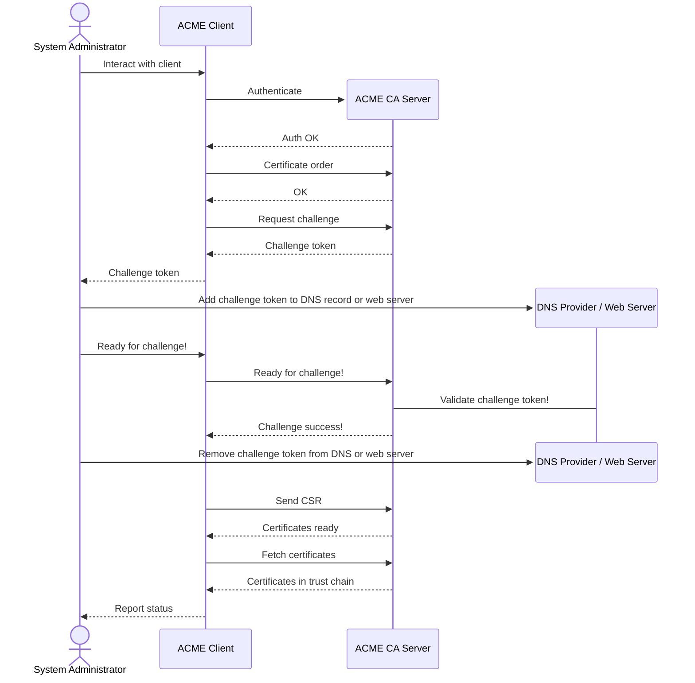

# ACME Sentry

A.C.M.E 2.0 client using the openssl bindings crate.
```
Rustc version: rustc 1.85.0 (4d91de4e4 2025-02-17)
```
ACME CA for Test: [Pebble](https://github.com/letsencrypt/pebble)

## Protocol
### Automated Certificate Management Environment version 2
The ACME2.0 protocol is the current version of the ACME protocol, a standard for automating
certificate issuance and management.  
ACME Sentry implements the client-side of RFC 8555.

A classic "happy-flow" case of how end users use the ACME protocol can be lifted from Certbot -
Let's Encrypt's ACME 2.0 client. For the sake of simplicity; "ACME Client" is Certbot and "ACME CA Server" is Let's Encrypt's
CA API.
